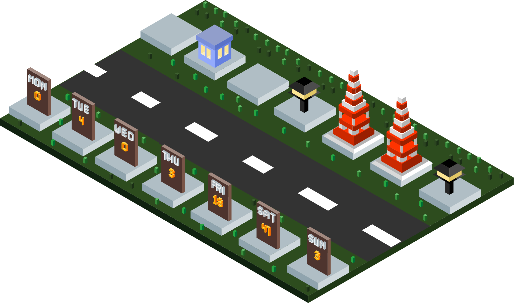

# 🏙️ Contribution City

GitHub contribution을 도시 스카이라인으로 시각화합니다.



## 사용법

1. 이 저장소를 fork 하거나 파일들을 복사하세요
2. `Actions` 탭에서 워크플로우를 활성화하세요
3. 수동으로 실행하거나 매일 자동 실행됩니다

## 파일 구조

```
├── generate.js                          # SVG 생성 스크립트
├── .github/workflows/contribution-city.yml  # GitHub Actions 워크플로우
└── profile-3d-contrib/
    └── contribution-city.svg            # 생성된 SVG
```

## 커스터마이징

`generate.js`에서 수정 가능:
- `buildingColors`: 건물 색상
- `maxHeight`: 최대 건물 높이
- 별, 달, 배경 등

## 레벨 기준

| 레벨 | Contributions | 건물 타입 |
|------|---------------|-----------|
| 0 | 0 | 🌳 공원 |
| 1 | 1-3 | 🏠 주택 |
| 2 | 4-6 | 🏢 빌딩 |
| 3 | 7-9 | 🏬 고층 |
| 4 | 10+ | 🗼 타워 |
